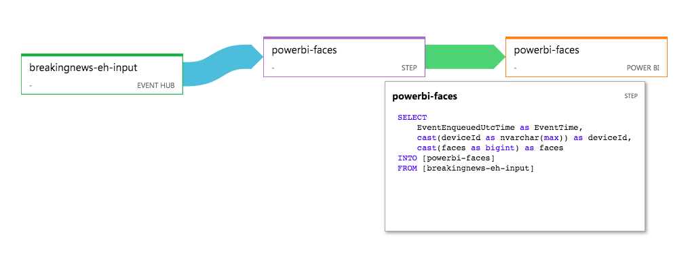

## Stream Analytics Setup

INPUT:
```
Event Hub: "breakingnews-eh-input"
```

OUTPUT (destination data set):
```
Power BI: "powerbi-faces"
```

QUERY:
```sql
SELECT
    EventEnqueuedUtcTime as EventTime,
    cast(deviceId as nvarchar(max)) as deviceId,
    cast(faces as bigint) as faces
INTO [powerbi-faces]
FROM [breakingnews-eh-input]
```

JOB DIAGRAM:

