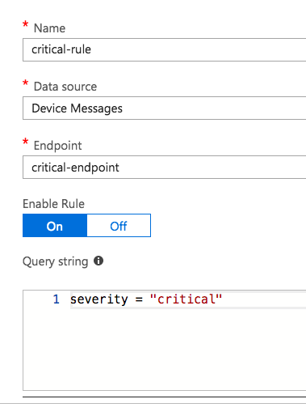

## Setup

Add a custom endpoint to your IoT Hub: 
Azure Portal --> IoT Hub --> **Endpoints** --> Add:

* Name: `critical-endpoint`
* Endpoint Type: `Service Bus Queue`
* Azure Resource : `SERVICE_BUS_NAMESPACE/critical`

Go to **Routes** and add this route:

